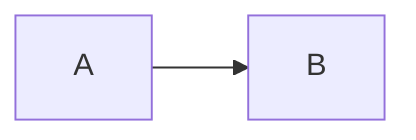

---
md:
  import:
    - from: "@acme/diagrams"
      names: [mermaid]
---

```mermaid {alt="A, then B"}
graph LR; A --> B
```

```mermaid {render=output alt="A, then B"}
graph LR; A --> B
```

```mermaid {render=source}
graph LR; A --> B
```

```mermaid {render=both theme=dark alt="A, then B"}
graph LR; A --> B
```
