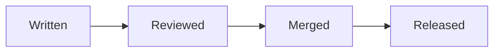

---
md:
  import:
    - from: "@comp-markdown/mermaid@0"
      names: [mermaid]
---

# How a change ships

Every change goes the same way, and nobody merges their own:

```mermaid {alt="A change is written, reviewed, merged, then released"}
graph LR
  Written --> Reviewed --> Merged --> Released
```
