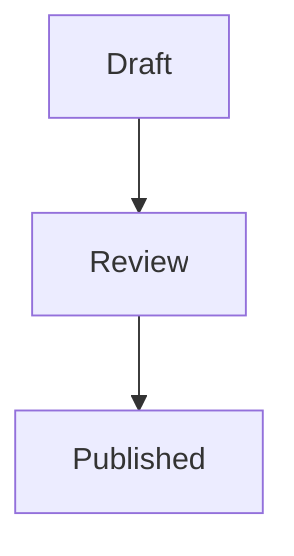

---
md:
  import:
    - from: ./minimermaid.js
      names: [minimermaid]
---

```compmd component=minimermaid signature
renders: mermaid
params:
  theme: default | dark | neutral = default
```


```mermaid {alt="Draft, then review, then published"}
graph TD; Draft --> Review --> Published
```
